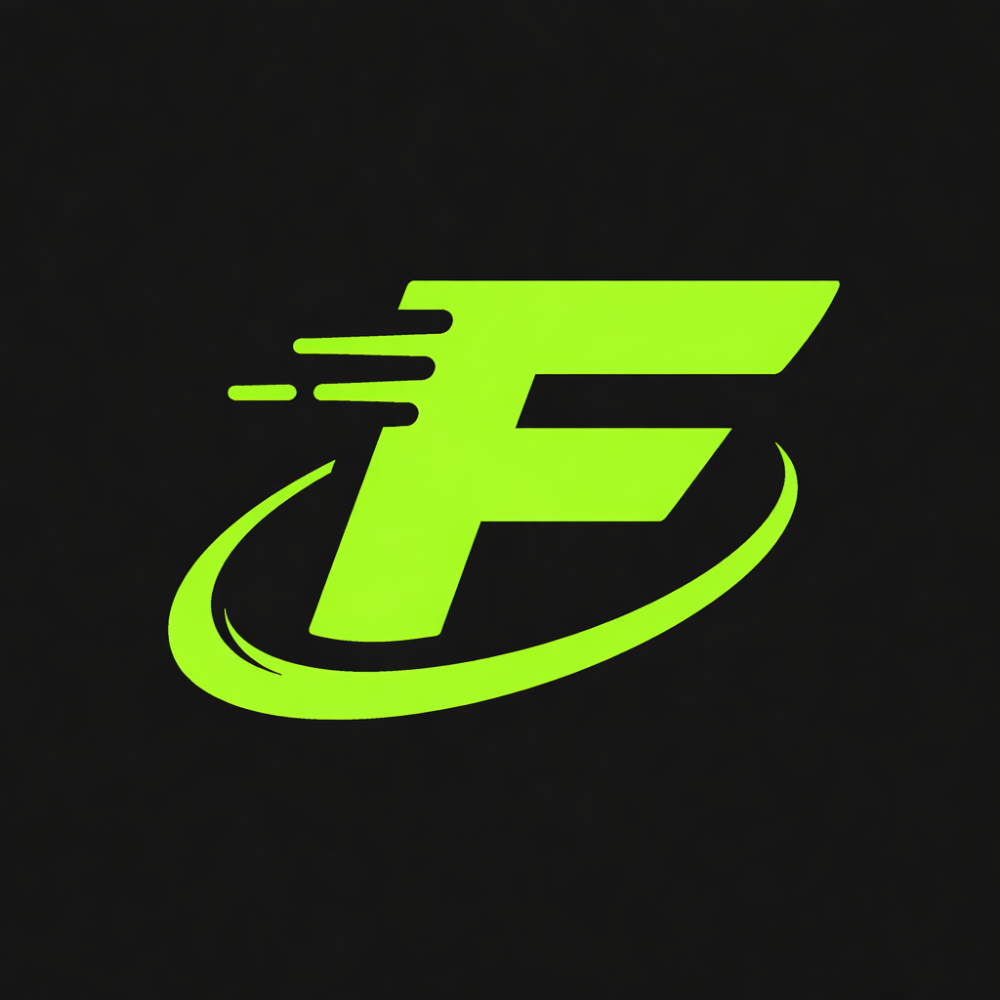
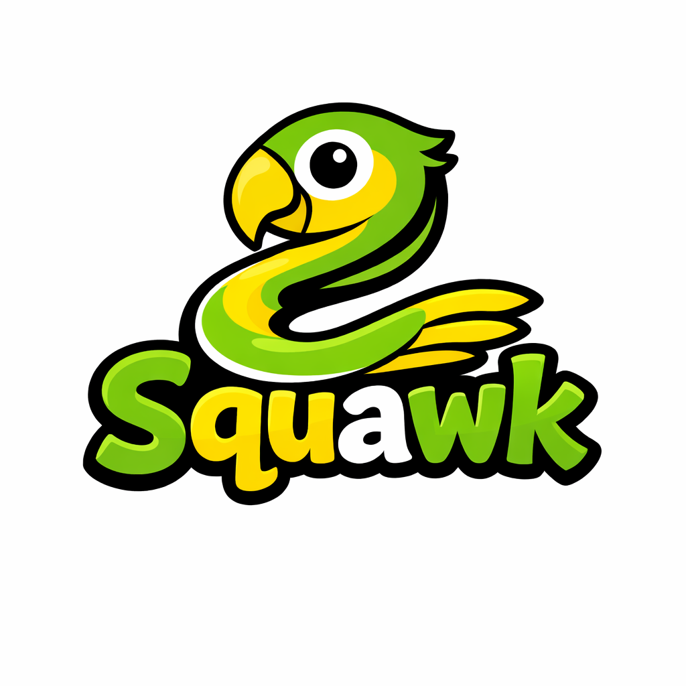

  
  <h1>Adam “Hnato” — Junior Software Developer</h1>
  
Building practical, reliable software • Learning by doing • Focused on clean, well-structured solutions

---

## About Me
I am an IT student and junior developer who enjoys turning ideas into working software. I combine theory with hands‑on experimentation: home‑lab projects, virtualization, server configuration, and network setups. I value clear structure, maintainable code, and incremental problem solving. When I find a gap in my knowledge, I study it until I understand it fully and can apply it in practice.

Current learning focus:
- C++, C#, Python, JavaScript, PHP, HTML, CSS
- Software design fundamentals, algorithms, and system thinking
- Practical deployment and operations in small projects

---

## Projects Portfolio

### Hnato.pl — Flagship Project
- Live demo: https://hnato.pl  
- Technologies: HTML, CSS, JavaScript, PHP  
- Highlights: Responsive, fast-loading landing experience and central hub for my projects. Emphasis on accessibility and clean UI.  
- Challenges solved: Managing consistent design across subprojects and handling lightweight server-side routing.  
- Key learning outcomes: Modular front‑end structure, basic backend templating, and deployment automation.  
  

---

### sp.hnato.pl — Personal Website
- Live demo: https://sp.hnato.pl  
- Technologies: HTML, CSS, JavaScript  
- Highlights: Professional profile, timeline of work, and project index designed for clarity and quick scanning.  
- Challenges solved: Information architecture for a growing portfolio; ensuring mobile-first usability.  
- Key learning outcomes: Semantic HTML, componentized styling, and design consistency.  
  

---

### pn.hnato.pl — ParrotNest
- Live demo: https://pn.hnato.pl  
- Technologies: JavaScript, WebSocket, HTML, CSS  
- Highlights: Real‑time, browser‑based messaging with presence indicators and responsive UI.  
- Challenges solved: Reliable message delivery, reconnection logic, and state synchronization across clients.  
- Key learning outcomes: Real‑time patterns, event-driven architecture, and UI state management.  
  

---

### bj.hnato.pl — Blackjack (JBH)
- Live demo: https://bj.hnato.pl  
- Technologies: JavaScript, HTML Canvas, CSS  
- Highlights: Casino Blackjack implemented with a focus on game state, UI transitions, and edge‑case rules.  
- Challenges solved: Turn sequencing, deck/shuffle correctness, and deterministic testable game logic.  
- Key learning outcomes: Game loop design, finite state machines, and clean separation between logic and rendering.  
  

---

### pj.hnato.pl — Solitaire
- Live demo: https://pj.hnato.pl  
- Technologies: JavaScript, HTML, CSS  
- Highlights: Classic Solitaire (Klondike) with drag‑and‑drop interactions and smooth animations.  
- Challenges solved: Efficient move validation, stack operations, and undo/redo mechanics.  
- Key learning outcomes: Algorithmic problem‑solving, data structures for card stacks, and UI performance.  
  

---

### sq.hnato.pl — Squawk
- Live demo: https://sq.hnato.pl  
- Technologies: C#, .NET, Unity (concept), HTML/CSS for landing  
- Highlights: Fast, browser‑playable arcade game inspired by classic mechanics with a modern twist.  
- Challenges solved: Smooth input handling, collision performance, and balancing gameplay feel.  
- Key learning outcomes: C# scripting patterns, component composition, and profiling for responsiveness.  
  

---

## Technical Skills

Languages and proficiency:
- C++ — Learning core algorithms and memory management basics
- C# — Comfortable with OOP, basic game/app scripting
- Python — Scripting, utilities, and prototyping
- JavaScript — Front‑end interactivity and simple game logic
- PHP — Lightweight server‑side logic and templating
- HTML & CSS — Semantic structure, responsive design, accessibility

Badges:
 

---

## Statistics

  
  
  

---

## Contact

- Website: https://hnato.pl
- Email: hnatobiznes@o2.pl
- GitHub: https://github.com/Hnato

If you are interested in collaboration, internships, or junior roles, feel free to reach out. I’m always open to feedback and new challenges.
